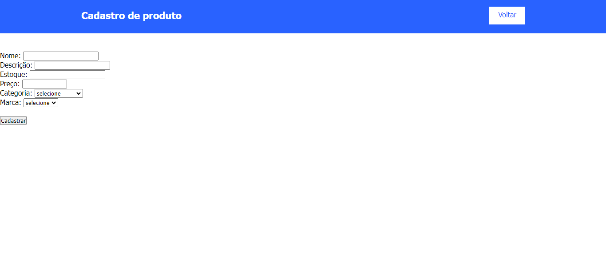

# Sistema de Cadastro de Produtos, Marcas e Categorias

## 𝗗𝗲𝘀𝗰𝗿𝗶𝗰̧𝗮̃𝗼📝
𝖤𝗌𝗍𝖾 𝗉𝗋𝗈𝗃𝖾𝗍𝗈 𝖾́ 𝗎𝗆 𝗌𝗂𝗌𝗍𝖾𝗆𝖺 𝖽𝖾 𝖼𝖺𝖽𝖺𝗌𝗍𝗋𝗈 𝖽𝖾𝗌𝖾𝗇𝗏𝗈𝗅𝗏𝗂𝖽𝗈 𝖾𝗆 𝖯𝖧𝖯, 𝗊𝗎𝖾 𝗉𝖾𝗋𝗆𝗂𝗍𝖾 𝖺 𝗀𝖾𝗌𝗍𝖺̃𝗈 𝖽𝖾 𝗉𝗋𝗈𝖽𝗎𝗍𝗈𝗌, 𝗆𝖺𝗋𝖼𝖺𝗌 𝖾 𝖼𝖺𝗍𝖾𝗀𝗈𝗋𝗂𝖺𝗌. 𝖮 𝗌𝗂𝗌𝗍𝖾𝗆𝖺 𝗂𝗇𝖼𝗅𝗎𝗂 𝖿𝗎𝗇𝖼𝗂𝗈𝗇𝖺𝗅𝗂𝖽𝖺𝖽𝖾𝗌 𝗉𝖺𝗋𝖺 𝖺𝖽𝗂𝖼𝗂𝗈𝗇𝖺𝗋 𝗇𝗈𝗏𝗈𝗌 𝗋𝖾𝗀𝗂𝗌𝗍𝗋𝗈𝗌 𝖾 𝗏𝗂𝗌𝗎𝖺𝗅𝗂𝗓𝖺𝗋 𝗂𝗇𝖿𝗈𝗋𝗆𝖺𝖼̧𝗈̃𝖾𝗌 𝖼𝖺𝖽𝖺𝗌𝗍𝗋𝖺𝖽𝖺𝗌.

## 𝐈𝐧𝐭𝐫𝐨𝐝𝐮𝐜̧𝐚̃𝐨📌
𝖢𝗈𝗆 𝗎𝗆𝖺 𝗂𝗇𝗍𝖾𝗋𝖿𝖺𝖼𝖾 𝗂𝗇𝗍𝗎𝗂𝗍𝗂𝗏𝖺 𝖾 𝖺𝗆𝗂𝗀𝖺́𝗏𝖾𝗅, 𝗈 𝗌𝗂𝗌𝗍𝖾𝗆𝖺 𝗉𝖾𝗋𝗆𝗂𝗍𝖾 𝖺𝗈𝗌 𝗎𝗌𝗎𝖺́𝗋𝗂𝗈𝗌 𝗋𝖾𝖺𝗅𝗂𝗓𝖺𝗋 𝖼𝖺𝖽𝖺𝗌𝗍𝗋𝗈𝗌 𝖽𝖾𝗍𝖺𝗅𝗁𝖺𝖽𝗈𝗌 𝖽𝖾 𝗉𝗋𝗈𝖽𝗎𝗍𝗈𝗌, 𝖺𝗌𝗌𝗈𝖼𝗂𝖺𝗇𝖽𝗈-𝗈𝗌 𝖺̀𝗌 𝗌𝗎𝖺𝗌 𝗋𝖾𝗌𝗉𝖾𝖼𝗍𝗂𝗏𝖺𝗌 𝗆𝖺𝗋𝖼𝖺𝗌 𝖾 𝖼𝖺𝗍𝖾𝗀𝗈𝗋𝗂𝖺𝗌. 𝖨𝗌𝗌𝗈 𝖿𝖺𝖼𝗂𝗅𝗂𝗍𝖺 𝖺 𝗈𝗋𝗀𝖺𝗇𝗂𝗓𝖺𝖼̧𝖺̃𝗈 𝖾 𝗈 𝖺𝖼𝖾𝗌𝗌𝗈 𝖺̀𝗌 𝗂𝗇𝖿𝗈𝗋𝗆𝖺𝖼̧𝗈̃𝖾𝗌, 𝗉𝗈𝗌𝗌𝗂𝖻𝗂𝗅𝗂𝗍𝖺𝗇𝖽𝗈 𝗎𝗆𝖺 𝖺𝖽𝗆𝗂𝗇𝗂𝗌𝗍𝗋𝖺𝖼̧𝖺̃𝗈 𝖽𝖾 𝖾𝗌𝗍𝗈𝗊𝗎𝖾 𝗆𝖺𝗂𝗌 𝖾𝖿𝗂𝖼𝗂𝖾𝗇𝗍𝖾. 𝖲𝖾𝗃𝖺 𝗉𝖺𝗋𝖺 𝗉𝖾𝗊𝗎𝖾𝗇𝖺𝗌 𝗅𝗈𝗃𝖺𝗌, 𝗀𝗋𝖺𝗇𝖽𝖾𝗌 𝗏𝖺𝗋𝖾𝗃𝗂𝗌𝗍𝖺𝗌 𝗈𝗎 𝗊𝗎𝖺𝗅𝗊𝗎𝖾𝗋 𝗇𝖾𝗀𝗈́𝖼𝗂𝗈 𝗊𝗎𝖾 𝗇𝖾𝖼𝖾𝗌𝗌𝗂𝗍𝖾 𝖽𝖾 𝗎𝗆 𝖼𝗈𝗇𝗍𝗋𝗈𝗅𝖾 𝗉𝗋𝖾𝖼𝗂𝗌𝗈 𝖽𝖾 𝗌𝖾𝗎 𝗂𝗇𝗏𝖾𝗇𝗍𝖺́𝗋𝗂𝗈, 𝖾𝗌𝗍𝖾 𝗌𝗂𝗌𝗍𝖾𝗆𝖺 𝗈𝖿𝖾𝗋𝖾𝖼𝖾 𝗍𝗈𝖽𝖺𝗌 𝖺𝗌 𝖿𝗎𝗇𝖼𝗂𝗈𝗇𝖺𝗅𝗂𝖽𝖺𝖽𝖾𝗌 𝗇𝖾𝖼𝖾𝗌𝗌𝖺́𝗋𝗂𝖺𝗌 𝗉𝖺𝗋𝖺 𝗎𝗆𝖺 𝗀𝖾𝗌𝗍𝖺̃𝗈 𝖾𝖿𝗂𝖼𝖺𝗓.

𝖠𝗅𝖾́𝗆 𝖽𝗂𝗌𝗌𝗈, 𝗈 𝗌𝗂𝗌𝗍𝖾𝗆𝖺 𝖾́ 𝖺𝗅𝗍𝖺𝗆𝖾𝗇𝗍𝖾 𝖾𝗌𝖼𝖺𝗅𝖺́𝗏𝖾𝗅 𝖾 𝗉𝗈𝖽𝖾 𝗌𝖾𝗋 𝖿𝖺𝖼𝗂𝗅𝗆𝖾𝗇𝗍𝖾 𝖺𝖽𝖺𝗉𝗍𝖺𝖽𝗈 𝗉𝖺𝗋𝖺 𝖺𝗍𝖾𝗇𝖽𝖾𝗋 𝖺̀𝗌 𝗇𝖾𝖼𝖾𝗌𝗌𝗂𝖽𝖺𝖽𝖾𝗌 𝖾𝗌𝗉𝖾𝖼𝗂́𝖿𝗂𝖼𝖺𝗌 𝖽𝖾 𝖼𝖺𝖽𝖺 𝖾𝗆𝗉𝗋𝖾𝗌𝖺, 𝗉𝗋𝗈𝗉𝗈𝗋𝖼𝗂𝗈𝗇𝖺𝗇𝖽𝗈 𝗎𝗆𝖺 𝗌𝗈𝗅𝗎𝖼̧𝖺̃𝗈 𝖿𝗅𝖾𝗑𝗂́𝗏𝖾𝗅 𝖾 𝗋𝗈𝖻𝗎𝗌𝗍𝖺 𝗉𝖺𝗋𝖺 𝖺 𝗀𝖾𝗌𝗍𝖺̃𝗈 𝖽𝖾 𝗉𝗋𝗈𝖽𝗎𝗍𝗈𝗌.

## 𝗙𝘂𝗻𝗰𝗶𝗼𝗻𝗮𝗹𝗶𝗱𝗮𝗱𝗲𝘀 ⚙️

- **Cadastro de Produtos**
- **Cadastro de Marcas**
- **Cadastro de Categorias**
- **Persistência de Dados em MySQL**

## 𝑇𝑒𝑙𝑎𝑠 𝑑𝑜 𝑆𝑖𝑠𝑡𝑒𝑚𝑎

### 𝑇𝑒𝑙𝑎 𝑑𝑒 𝐶𝑎𝑑𝑎𝑠𝑡𝑟𝑜 𝑑𝑒 𝑃𝑟𝑜𝑑𝑢𝑡𝑜𝑠



### 𝑇𝑒𝑙𝑎 𝑑𝑒 𝐶𝑎𝑑𝑎𝑠𝑡𝑟𝑜 𝑑𝑒 𝑀𝑎𝑟𝑐𝑎𝑠


### 𝑇𝑒𝑙𝑎 𝑑𝑒 𝐶𝑎𝑑𝑎𝑠𝑡𝑟𝑜 𝑑𝑒 𝐶𝑎𝑡𝑒𝑔𝑜𝑟𝑖𝑎𝑠


## 𝐸𝑠𝑡𝑟𝑢𝑡𝑢𝑟𝑎 𝑑𝑜 𝐵𝑎𝑛𝑐𝑜 𝑑𝑒 𝐷𝑎𝑑𝑜𝑠

O banco de dados possui as seguintes tabelas:

- **produtos** - Armazena informações sobre os produtos cadastrados.
- **marca** - Armazena informações sobre as marcas dos produtos.
- **categoria** - Armazena informações sobre as categorias dos produtos.

## 𝐌𝐞́𝐭𝐨𝐝𝐨𝐬 𝐏𝐇𝐏 𝐔𝐭𝐢𝐥𝐢𝐳𝐚𝐝𝐨𝐬

### Produto

Arquivo: `produto.php`

```php
<?php
include_once('controller/conexao.php');
?>

<!DOCTYPE html>
<html lang="en">
<head>
    <meta charset="UTF-8">
    <meta http-equiv="X-UA-Compatible" content="IE=edge">
    <meta name="viewport" content="width=device-width, initial-scale=1.0">
    <title>Cadastro de produtos</title>
    <link rel="stylesheet" href="css/style.css">
</head>
<body>
    <header>
        <div class="center">
            <h1>Cadastro de produto</h1>
            <a href="index.php" target="_self">Voltar</a>
        </div>
    </header>
    <section id="produtos">
        <form action="insere-produto.php" method="post">
            Nome: <input type="text" name="nome"><br>
            Descrição: <input type="text" name="descricao"><br>
            Estoque: <input type="number" name="estoque"><br>
            Preço: <input type="number" name="preco" min="0.00" max="10000.00" step="0.01"><br>
            Categoria:
            <select name="seleciona_categoria" id="">
                <option value="">selecione</option>
                <?php
                    $resultado_categoria = "SELECT * FROM categoria";
                    $resultadocategoria = mysqli_query($mysqli, $resultado_categoria);
                    while($row_categorias = mysqli_fetch_assoc($resultadocategoria)){ ?>
                    <option value="<?php echo $row_categorias['IDCATEGORIA'] ?>">
                    <?php echo $row_categorias['DESCRICAO'] ?></option>
                <?php
                    }
                ?>
            </select>
            <br>
            Marca:
            <select name="seleciona_marca" id="">
                <option value="">selecione</option>
                <?php
                    $resultado_marca = "SELECT * FROM marca";
                    $resultadomarca = mysqli_query($mysqli, $resultado_marca);
                    while($row_marcas = mysqli_fetch_assoc($resultadomarca)){ ?>
                    <option value="<?php echo $row_marcas['IDMARCA'] ?>">
                    <?php echo $row_marcas['DESCRICAO'] ?></option>
                <?php
                    }
                ?>
            </select>
            <br><br>
            <input type="submit" value="Cadastrar">
        </form>
    </section>
</body>
</html>
```
𝙈𝙖𝙧𝙘𝙖
𝘼𝙧𝙦𝙪𝙞𝙫𝙤: `marca.php`
```php
<!DOCTYPE html>
<html lang="en">
<head>
    <meta charset="UTF-8">
    <meta http-equiv="X-UA-Compatible" content="IE=edge">
    <meta name="viewport" content="width=device-width, initial-scale=1.0">
    <title>Cadastro de marca</title>
    <link rel="stylesheet" href="css/style.css">
</head>
<body>
    <header>
        <div>
            <h1>Cadastro de marca</h1>
            <a href="index.php" target="_self">Voltar</a>
        </div>
    </header>
    <section id="produtos">
        <form action="insere-marca.php" method="post">
            <label for="">Descrição: </label>
            <input type="text" name="descricao">
            <input type="submit" value="Cadastrar">
        </form>
    </section>
</body>
</html>
```
𝘾𝙖𝙩𝙚𝙜𝙤𝙧𝙞𝙖
𝘼𝙧𝙦𝙪𝙞𝙫𝙤: `categoria.php`
```php
<!DOCTYPE html>
<html lang="en">
<head>
    <meta charset="UTF-8">
    <meta http-equiv="X-UA-Compatible" content="IE=edge">
    <meta name="viewport" content="width=device-width, initial-scale=1.0">
    <title>Cadastro de Categorias</title>
    <link rel="stylesheet" href="css/style.css">
</head>
<body>
    <header>
        <div>
            <h1>Cadastro de Categoria</h1>
            <a href="index.php" target="_self">Voltar</a>
        </div>
    </header>
    <section id="produtos">
        <form action="insere-categoria.php" method="post">
            <label for="">Descrição: </label>
            <input type="text" name="descricao">
            <input type="submit" value="Cadastrar">
        </form>
    </section>
</body>
</html>
```
𝙄𝙣𝙨𝙚𝙧𝙘̧𝙖̃𝙤 𝙙𝙚 𝙋𝙧𝙤𝙙𝙪𝙩𝙤
𝘼𝙧𝙦𝙪𝙞𝙫𝙤: `insere-produto.php`
```php
<?php
include_once('controller/conexao.php');

$categoria = $_POST['seleciona_categoria'];
$marca = $_POST['seleciona_marca'];
$nome_produto = $_POST['nome'];
$descricao = $_POST['descricao'];
$estoque = $_POST['estoque'];
$preco = $_POST['preco'];

$grava_produto = "INSERT INTO produtos(IDCATEGORIA, IDMARCA, NOME, DESCRICAO, ESTOQUE, PRECO) VALUES ('$categoria', '$marca', '$nome_produto', '$descricao', '$estoque', '$preco')";
$result_gravacao = mysqli_query($mysqli, $grava_produto);

if (mysqli_affected_rows($mysqli) != 0) {
    echo "<META HTTP-EQUIV=REFRESH CONTENT = '0;URL=produtos.php'>
          <script type=\"text/javascript\">
          alert('Produto cadastrado com sucesso');
          </script>";
} else {
    echo "<META HTTP-EQUIV=REFRESH CONTENT = '0;URL=produtos.php'>
          <script type=\"text/javascript\">
          alert('Produto não cadastrado');
          </script>";
}
?>
```
𝙄𝙣𝙨𝙚𝙧𝙘̧𝙖̃𝙤 𝙙𝙚 𝙈𝙖𝙧𝙘𝙖
𝘼𝙧𝙦𝙪𝙞𝙫𝙤: `insere-marca.php`
```php
<?php
include('controller/conexao.php');

$descricao = $_POST['descricao'];
echo "<h3>Descrição: $descricao </h3></br>";

$cad_marca = "INSERT INTO marca(DESCRICAO) VALUES ('$descricao')";

if (mysqli_query($mysqli, $cad_marca)) {
    echo "<h1>Marca cadastrada com sucesso!</h1></br>";
} else {
    echo "Erro: " . $cad_marca . "</br>";
    mysqli_error($mysqli);
}

mysqli_close($mysqli);
?>
```
𝙄𝙣𝙨𝙚𝙧𝙘̧𝙖̃𝙤 𝙙𝙚 𝘾𝙖𝙩𝙚𝙜𝙤𝙧𝙞𝙖
𝘼𝙧𝙦𝙪𝙞𝙫𝙤: `insere-categoria.php`
```php
<?php
include('controller/conexao.php');

$descricao = $_POST['descricao'];
echo "<h3>Descrição: $descricao </h3></br>";

$cad_categoria = "INSERT INTO categoria(DESCRICAO) VALUES ('$descricao')";

if (mysqli_query($mysqli, $cad_categoria)) {
    echo "<h1>Categoria cadastrada com sucesso!</h1></br>";
} else {
    echo "Erro: " . $cad_categoria . "</br>";
    mysqli_error($mysqli);
}

mysqli_close($mysqli);
?>
```
𝐑𝐞𝐟𝐞𝐫𝐞̂𝐧𝐜𝐢𝐚𝐬
𝖣𝗈𝖼𝗎𝗆𝖾𝗇𝗍𝖺𝖼̧𝖺̃𝗈 𝖽𝗈 𝖯𝖧𝖯
𝖦𝗎𝗂𝖺 𝖽𝖾 𝖱𝖾𝖿𝖾𝗋𝖾̂𝗇𝖼𝗂𝖺 𝖽𝗈 𝖬𝗒𝖲𝖰𝖫
𝖯𝖺𝗋𝖺 𝗆𝖺𝗂𝗌 𝖽𝖾𝗍𝖺𝗅𝗁𝖾𝗌 𝗌𝗈𝖻𝗋𝖾 𝗈 𝗉𝗋𝗈𝗃𝖾𝗍𝗈 𝖾 𝖼𝗈𝗇𝗍𝗋𝗂𝖻𝗎𝗂𝖼̧𝖺̃𝗈, 𝖼𝗈𝗇𝗌𝗎𝗅𝗍𝖾 𝗈 𝗋𝖾𝗉𝗈𝗌𝗂𝗍𝗈́𝗋𝗂𝗈 𝗇𝗈 𝖦𝗂𝗍𝖧𝗎𝖻.

 ### Tecnologia utilizadas ⌨️ 
* 𝗛𝗧𝗠𝗟
* 𝗖𝗦𝗦
* 𝗚𝗜𝗧𝗛𝗨𝗕
* 𝗣𝗛𝗣

## Autores ✒️
 [Veronica](https://github.com/veronicarodrigues07) 🙋‍♀️


